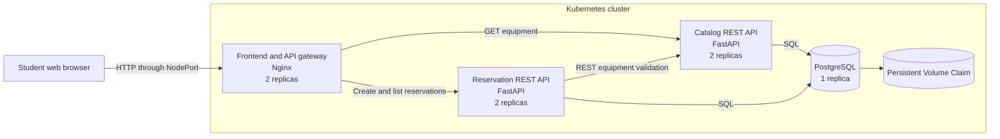

# CampusCart Architecture Design

## 1. System purpose

CampusCart is a university equipment reservation system. Students can view equipment such as cameras, laptops, and projectors and reserve a quantity for a date range.

The application was deliberately kept small enough to implement and demonstrate within this assignment. A single application would be simpler at its current size. The microservice design becomes more reasonable in an assumed multi-campus scenario where equipment browsing receives considerably more traffic than reservation processing and different development teams maintain the two business capabilities.

## 2. Architecture overview

Kubernetes Deployments manage the stateless application Pods. A Deployment is appropriate because replicas of each application service are interchangeable and Kubernetes can replace failed Pods. Kubernetes Services provide stable names and load-balance requests across the matching Pods. The frontend is exposed using a NodePort, while the APIs and database use internal ClusterIP Services. This follows the documented behavior of [Kubernetes workloads](https://kubernetes.io/docs/concepts/workloads/) and [Kubernetes Services](https://kubernetes.io/docs/concepts/services-networking/service/).

## 3. Component-to-microservice mapping

| Software component | Implementation | Responsibility |
|---|---|---|
| User interface | Frontend container using HTML, CSS, JavaScript, and Nginx | Displays equipment and reservations and submits browser requests |
| API gateway | Nginx configuration in the frontend container | Routes `/api/catalog` and `/api/reservations` to the appropriate internal service |
| Equipment catalogue | Catalog FastAPI microservice | Provides REST operations for equipment and owns the `equipment` table |
| Reservation management | Reservation FastAPI microservice | Provides reservation REST operations, validates equipment through the Catalog API, prevents overbooking, and owns the `reservations` table |
| Data storage | PostgreSQL container | Stores application data transactionally |
| Persistent storage | Kubernetes PersistentVolumeClaim | Keeps PostgreSQL data independently of the lifetime of a database Pod |
| Container registry | Docker Hub | Stores public versioned application images for Kubernetes |
| Container orchestration | Kubernetes running through Minikube | Schedules, networks, monitors, restarts, and scales containers |

## 4. Component responsibilities

### Frontend and API gateway

The frontend is the only application component exposed outside the cluster. It presents a browser interface that requires no additional client software.

Nginx also acts as an API gateway. The browser sends all requests to one origin, and Nginx forwards each request to the correct internal service. This hides internal addresses from the browser and avoids cross-origin configuration.

### Catalog service

The Catalog service manages equipment information. Its REST API supports listing all equipment, retrieving an individual item, and creating an item.

It does not contain reservation logic. This gives it a clear business responsibility and allows it to scale independently when browsing traffic increases.

### Reservation service

The Reservation service creates and retrieves bookings. Before accepting a booking, it programmatically calls the Catalog REST API. This confirms that the equipment exists and obtains the number of units owned.

It calculates the quantity already reserved for overlapping dates. A PostgreSQL advisory transaction lock serializes concurrent booking attempts for the same equipment item. This protects against overbooking when several Reservation replicas receive requests simultaneously.

### PostgreSQL

PostgreSQL is deployed separately with one replica. Both application services use the same physical database instance but own different tables. This choice reduces infrastructure requirements for the assignment.

A larger production system could use a separate database or schema and credentials for each service. That would strengthen isolation and prevent one service from depending on another service’s storage implementation.

### Persistent volume

Container files are ephemeral, so database records would normally disappear when a database Pod is replaced. The PostgreSQL Deployment mounts a PersistentVolumeClaim at its data directory. The volume lifecycle is independent of an individual Pod, as described by the [Kubernetes Persistent Volume model](https://kubernetes.io/docs/concepts/storage/persistent-volumes/).

The implementation preserves data across Pod and Deployment restarts. Because Minikube uses local development storage, deleting the entire Minikube cluster may delete the data. Production should use a cloud disk with an appropriate retention policy and backups.

## 5. Architecture principles and patterns

### Microservices by business capability

Catalog and Reservation represent separate business capabilities. Each exposes a REST contract and can be changed, deployed, and scaled independently.

### Stateless service instances

Catalog, Reservation, and frontend replicas keep no durable state in their containers. Any replica can process a request. Durable state is placed in PostgreSQL, making horizontal replication possible.

### API gateway

The frontend gateway provides one external entry point and routes requests internally. A production gateway could additionally provide authentication, TLS termination, rate limiting, and request tracing.

### Service discovery

Services communicate using Kubernetes DNS names such as `catalog-api` and `postgres`. Application Pods do not depend on changing Pod IP addresses.

### Synchronous REST communication

The Reservation service calls the Catalog service synchronously because it needs an immediate decision before accepting a booking. This is simple and provides a clear consistency boundary, although it makes reservation creation temporarily dependent on Catalog availability.

### Declarative infrastructure

The Kubernetes YAML describes the desired replica counts, images, ports, probes, resources, networking, and storage. Kubernetes continually tries to make the running system match this declared state.

### Health checking and self-healing

Readiness probes prevent traffic from reaching a Pod until it is ready. Liveness probes allow Kubernetes to restart a container that stops responding. Deployments recreate missing Pods automatically.

### Externalized configuration

Database connection information and service addresses are supplied through environment variables. Database credentials are stored in a Kubernetes Secret rather than application source code.

### Independent horizontal scaling

Catalog and Reservation are separate Deployments. Changing the Catalog replica count does not change Reservation or PostgreSQL. Kubernetes defines horizontal scaling as running multiple instances of a workload and supports both manual and automatic scaling through a HorizontalPodAutoscaler ([Kubernetes autoscaling documentation](https://kubernetes.io/docs/concepts/workloads/autoscaling/)).

## 6. Benefits

### Scaling efficiency

Browsing equipment may be much more frequent than making reservations. Independent scaling allows the business to add Catalog replicas without paying for unnecessary Reservation replicas.

### Fault isolation

Failure of one Catalog Pod does not stop the service because requests can reach another replica. Kubernetes also recreates failed Pods. The Reservation service can report a controlled `503 Service Unavailable` response if Catalog cannot be reached.

### Independent development and deployment

The services have separate source folders, dependencies, Dockerfiles, images, and Kubernetes Deployments. Teams could release one capability without rebuilding the other.

### Portability and repeatability

The same versioned container images can run on Minikube or a managed Kubernetes service. Declarative configuration reduces differences between environments.

### Business growth

A multi-campus service could experience seasonal peaks around project deadlines. Horizontal scaling allows additional capacity to be added during those periods and removed afterward.

## 7. Challenges and mitigations

### Operational complexity

Microservices introduce more containers, network routes, configuration, logs, and failure modes than a monolith.

Current mitigations include health endpoints, probes, structured Kubernetes resources, resource limits, versioned images, and one namespace. Production should add centralized logging, metrics, alerts, and distributed tracing.

### Network latency and partial failure

Reservation creation depends on a network call to Catalog. A slow or unavailable Catalog service can delay or prevent a reservation.

The implementation uses a five-second HTTP timeout and returns a controlled `503` response. Further improvements include retries with exponential backoff for safe operations, circuit breaking, and availability monitoring.

### Data coupling

Both services currently share one PostgreSQL instance. This is economical but creates a shared infrastructure dependency and a possible performance bottleneck.

Each service owns its table and communicates business information through REST rather than reading the other service’s table. A larger system could use separate databases and asynchronous events to distribute necessary data.

### Concurrent reservations

Multiple Reservation replicas could calculate availability simultaneously and overbook equipment.

The implementation uses a PostgreSQL advisory transaction lock for each equipment item. Only one overlapping reservation calculation for an item can complete at a time.

### Database availability

PostgreSQL has one replica and is therefore a single point of failure. This is permitted by the assignment, but it is unsuitable for a critical production service.

Production mitigation could use a managed PostgreSQL service with automated failover, backups, point-in-time recovery, and multi-zone replication.

### Cost

At this demonstration scale, seven application and database Pods use more memory and administration effort than a monolith. The business case depends on higher traffic, independent team ownership, different scaling profiles, or stronger release isolation.

## 8. Security discussion

### Controls implemented

- The APIs validate field types, lengths, ranges, identifiers, and dates through FastAPI models.
- API containers run with a verified non-root numeric user.
- PostgreSQL and both APIs use internal ClusterIP Services.
- Only the frontend NodePort is externally accessible.
- Database credentials are provided through a Kubernetes Secret and are not committed to Git.
- Resource requests and limits reduce accidental resource exhaustion.
- Explicit dependency and image versions improve reproducibility.
- Reservation queries use SQLAlchemy parameters rather than constructing SQL from user input.
- Health endpoints expose only basic status information.

### Remaining risks

The demonstration uses HTTP without encryption. It also has no user authentication or authorization, so anyone who can access the NodePort can create reservations. The development database password is intentionally simple.

Kubernetes Secrets are not automatically equivalent to a dedicated secret manager. The Kubernetes documentation states that Secrets may be stored unencrypted in etcd unless encryption at rest is configured. Access should therefore be restricted using least-privilege RBAC ([Kubernetes Secrets](https://kubernetes.io/docs/concepts/configuration/secret/) and [RBAC guidance](https://kubernetes.io/docs/concepts/security/rbac-good-practices/)).

### Production mitigations

A production version should add:

- HTTPS using an Ingress or Gateway with managed certificates
- University single sign-on using OpenID Connect or OAuth 2.0
- Role-based authorization for students and administrators
- NetworkPolicies allowing only required service-to-service traffic
- Rate limiting and request-size limits at the gateway
- A managed secret store and encryption at rest
- Automated container vulnerability scanning
- Database backups and restore testing
- Audit logging without recording passwords or sensitive personal data
- Retention rules for student information
- CI/CD security checks and signed container images

## 9. Conclusion

CampusCart meets the assignment requirements through two independently scalable REST microservices, a separate PostgreSQL database, persistent storage, Docker Hub images, and external browser access through Kubernetes.

The architecture demonstrates the advantages of independent scaling and deployment while acknowledging the additional cost, network dependency, security responsibilities, and operational complexity introduced by microservices.